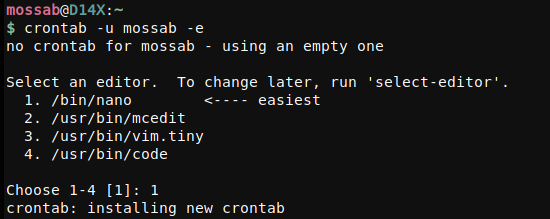
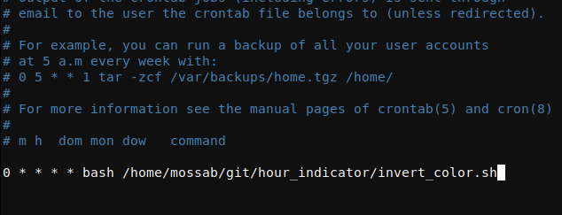

# Hour indicator

# Description (why)
This solves the problem of not feeling the time when using computer, at the start of a new hour the screen colors
will be inverted and go back to normal again (mimicking shock effect in cartoons and anime)
# How to use
1. install xcalib : for debian used distro you can use `sudo apt install xcalib`
1. put the script `invert_color.sh` somewhere (I'm using /home/mossab/git/hour_indicator/invert_color.sh)
1. set a new cron job to run it (I'm using user specific conf) :

`crontab -u USERNAME -e`

if this is your first time running crontab it'll ask for default text editor (went with nano)

add the following :
`0 * * * * bash SET_PATH_HERE/invert_color.sh`

1. save CTRL-O , exit CTRL+X , Done.
# Features 
see Description. 
# Currently working on

# TODO
- adding a transition to the effect would be nice
- set seconds for which effect last from command line (for now you can edit sleep X in `invert_color.sh`)
